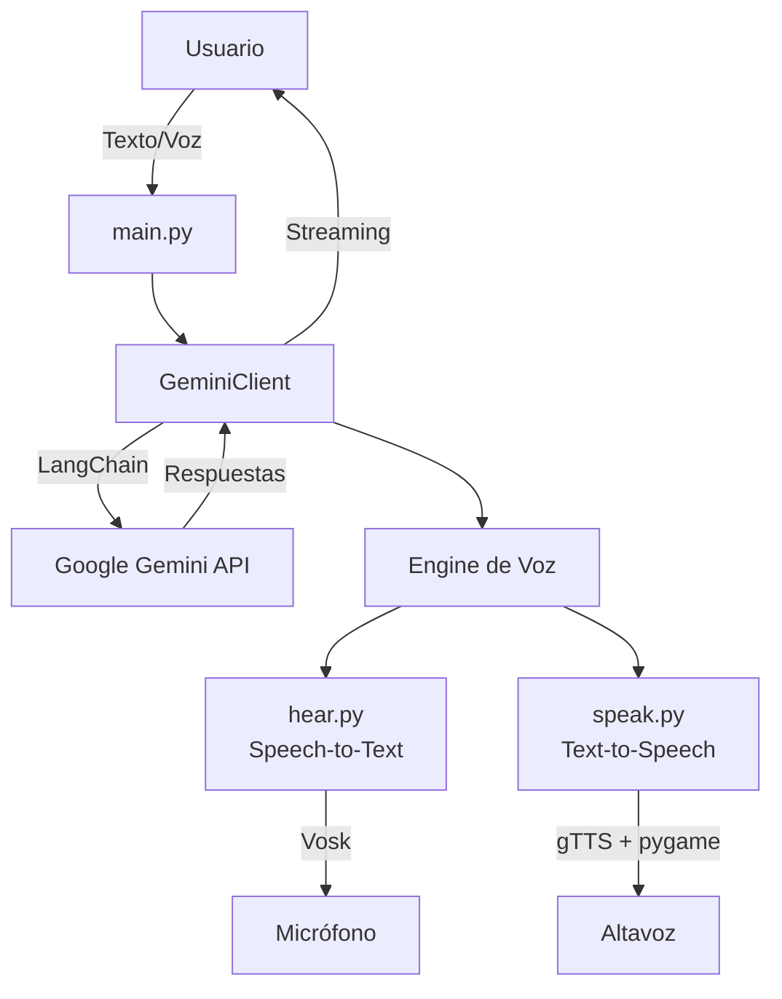
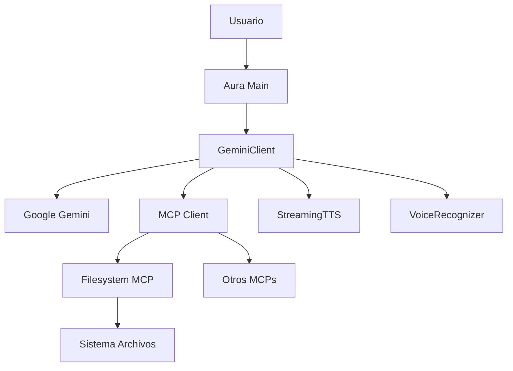

# 🤖 Aura_Gemini - Cliente Inteligente con Capacidades de Voz para Google Gemini

> ⚡ **IMPORTANTE**: Este sistema incluye streaming de texto en tiempo real y TTS (Text-to-Speech) en paralelo, permitiendo escuchar las respuestas mientras se generan. Esta funcionalidad es crítica para respuestas largas.

## 📋 Índice
- [Introducción](#introducción)
- [Arquitectura del Sistema](#arquitectura-del-sistema)
- [Requisitos y Dependencias](#requisitos-y-dependencias)
- [Estructura del Proyecto](#estructura-del-proyecto)
- [Algoritmo y Flujo de Trabajo](#algoritmo-y-flujo-de-trabajo)
- [Componentes Principales](#componentes-principales)
- [Instalación y Configuración](#instalación-y-configuración)
- [Uso del Sistema](#uso-del-sistema)
- [Características Avanzadas](#características-avanzadas)
- [Detalles Técnicos de Implementación](#detalles-técnicos-de-implementación)
- [Resolución de Problemas](#resolución-de-problemas)
- [Integración con Brave Search MCP](#integración-con-brave-search-mcp)

## 🌟 Introducción

Aura_Gemini es un cliente inteligente para [Google Gemini](https://ai.google.dev/) usando [LangChain](https://langchain.com/) que extiende las capacidades del modelo de lenguaje con funcionalidades de voz bidireccionales. El sistema permite:

- **Entrada por voz**: Reconocimiento de voz en español usando Vosk
- **Salida por voz**: Síntesis de voz con gTTS (Google Text-to-Speech)
- **Streaming en tiempo real**: Respuestas progresivas del modelo
- **TTS paralelo**: Síntesis de voz mientras el modelo genera respuestas
- **Gestión inteligente de contexto**: Mantiene historial de conversación con límites configurables

## 🏗️ Arquitectura del Sistema



### Componentes Arquitectónicos

1. **Capa de Presentación** (`main.py`)
   - Punto de entrada del sistema
   - Gestión de argumentos de línea de comandos
   - Verificación de servicios disponibles

2. **Capa de Lógica de Negocio** (`client.py`)
   - Cliente LangChain para Google Gemini API
   - Gestión de conversaciones y contexto con mensajes tipados
   - Integración con módulos de voz
   - Streaming de respuestas mediante generadores

3. **Capa de Servicios de Voz** (`engine/voice/`)
   - **STT (Speech-to-Text)**: Reconocimiento de voz offline
   - **TTS (Text-to-Speech)**: Síntesis de voz con streaming

## 📦 Requisitos y Dependencias

### Dependencias de Python
```txt
requests>=2.31.0        # Cliente HTTP (usado para verificaciones)
langchain>=0.1.0        # Framework LangChain
langchain-google-genai>=0.0.6  # Integración Google Gemini
google-generativeai>=0.3.0     # API de Google Generative AI
sounddevice>=0.4.6      # Captura de audio del micrófono
vosk>=0.3.45           # Motor de reconocimiento de voz offline
gtts>=2.4.0            # Google Text-to-Speech
pygame>=2.5.2          # Reproducción de audio
numpy>=1.24.0          # Procesamiento de arrays (dependencia de vosk)
```

### Requisitos del Sistema
- **API Key de Google**: Clave de API para Google Generative AI
- **Modelo Vosk**: Modelo español en `engine/voice/vosk-model-es-0.42`
- **Audio**: Micrófono y altavoces funcionales
- **Python**: 3.8 o superior
- **Conexión a Internet**: Requerida para Google Gemini API

## 📁 Estructura del Proyecto

```
Aura_Gemini/
├── main.py                 # Punto de entrada principal
├── client.py              # Cliente Gemini/LangChain con lógica de negocio
├── requirements.txt       # Dependencias del proyecto
└── engine/
    └── voice/
        ├── hear.py        # Módulo STT (Speech-to-Text)
        └── speak.py       # Módulo TTS (Text-to-Speech)
```

## 🔄 Algoritmo y Flujo de Trabajo

### 1. Inicialización del Sistema

```python
# main.py - Flujo de inicialización
def main():
    1. Configurar tamaño de contexto (100,000 tokens para Gemini)
    2. Verificar argumentos (--no-voice para desactivar voz)
    3. Crear instancia de GeminiClient
    4. Verificar disponibilidad del modelo
    5. Mostrar modelo activo
    6. Mostrar información de contexto
    7. Decidir modo de operación:
       - Modo prompt único: Si hay argumentos
       - Modo chat interactivo: Sin argumentos
```

### 2. Cliente Gemini - Algoritmo Principal

#### 2.1. Inicialización del Cliente

```python
class GeminiClient:
    def __init__(self):
        - Configurar API Key de Google
        - Establecer modelo (gemini-2.0-flash-exp)
        - Inicializar modelo LangChain ChatGoogleGenerativeAI
        - Inicializar historial con BaseMessage de LangChain
        - Verificar disponibilidad de voz
        - Inicializar componentes de voz si están disponibles
```

#### 2.2. Generación de Respuestas

El algoritmo de generación sigue estos pasos:

```python
def generate_response(prompt, stream, use_history, voice_streaming):
    1. Validar entrada no vacía y modelo inicializado
    2. Construir lista de mensajes (HumanMessage/AIMessage)
    3. Si use_history:
       - Incluir historial reciente (últimos 10 mensajes)
       - Mensajes ya tipados con LangChain
    4. Agregar mensaje actual como HumanMessage
    5. Si stream=True:
       - Usar generador stream() del modelo
       - Inicializar TTS paralelo si voice_streaming=True
       - Procesar respuesta chunk por chunk
       - Enviar cada chunk a TTS si está activo
    6. Si stream=False:
       - Usar invoke() para respuesta completa
       - Obtener content del response
    7. Actualizar historial con mensajes tipados
    8. Gestionar límites de contexto automáticamente
```

#### 2.3. Gestión de Contexto

```python
def _trim_history_if_needed():
    # Algoritmo de recorte inteligente
    1. Calcular tokens totales (1 token ≈ 4 caracteres)
    2. Si tokens > 75% del contexto máximo:
       - Eliminar mensajes más antiguos
       - Mantener al menos 1 par usuario-asistente
    3. Preservar coherencia conversacional
```

### 3. Sistema de Voz - Algoritmos

#### 3.1. Speech-to-Text (STT) - hear.py

```python
# Algoritmo de reconocimiento de voz
def listen_for_command(recognizer, timeout=5):
    1. Limpiar cola de audio previa
    2. Abrir stream de audio:
       - Sample rate: 16000 Hz
       - Blocksize: 8000
       - Mono, int16
    3. Capturar audio en tiempo real:
       - Callback envía datos a cola
       - Procesar chunks con Vosk
    4. Detectar fin de habla:
       - Si AcceptWaveform() = True: frase completa
       - Si timeout: terminar captura
    5. Obtener resultado final con FinalResult()
    6. Devolver texto reconocido
```

#### 3.2. Text-to-Speech (TTS) - speak.py

```python
# Algoritmo de síntesis básica
def speak(text):
    1. Validar texto no vacío
    2. Generar audio con gTTS:
       - Idioma: español
       - Velocidad: normal/lenta
    3. Guardar en archivo temporal MP3
    4. Cargar con pygame.mixer
    5. Reproducir y esperar finalización
    6. Limpiar archivo temporal
```

#### 3.3. TTS Streaming Secuencial

```python
class StreamingTTS:
    # Algoritmo de TTS en streaming con orden garantizado
    def _tts_worker():
        1. Mantener buffer de texto y contador de palabras
        2. Por cada chunk recibido:
           - Agregar a buffer
           - Buscar finales de oración (. ! ? \n : ;)
        3. Si encuentra oración completa:
           - Extraer oración del buffer
           - Sintetizar y reproducir secuencialmente (con lock)
        4. Si buffer > 8 palabras sin puntuación:
           - Tomar primeras 6 palabras
           - Reproducir y mantener resto en buffer
        5. Usar threading.Lock para garantizar orden secuencial
        6. Al recibir señal de fin:
           - Procesar texto restante
           - Terminar thread
```

### 4. Flujo de Chat Interactivo

```python
def chat():
    1. Mostrar información inicial
    2. Loop principal:
       a. Leer entrada del usuario
       b. Procesar comandos especiales:
          - 'salir/exit': Terminar
          - 'stream': Toggle streaming
          - 'historial': Mostrar conversación
          - 'limpiar': Borrar historial
          - 'info': Estadísticas de contexto
          - 'escuchar': Activar STT
          - 'voz': Toggle TTS
          - 'voz-streaming': TTS paralelo
       c. Si es pregunta normal:
          - Generar respuesta con configuración actual
          - Si streaming + voz: TTS paralelo
          - Si no streaming + voz: TTS después
       d. Manejar interrupciones (Ctrl+C)
```

## 🧩 Componentes Principales

### 1. GeminiClient (client.py)

**Responsabilidades:**
- Integración con Google Gemini mediante LangChain
- Gestión de contexto con mensajes tipados (HumanMessage/AIMessage)
- Integración de capacidades de voz
- Streaming de respuestas mediante generadores

**Métodos Principales:**
- `generate_response()`: Núcleo de generación con LangChain
- `_stream_response()`: Procesamiento con generador stream()
- `_get_recent_history()`: Obtención de historial reciente
- `chat()`: Loop interactivo principal

### 2. Módulo STT (engine/voice/hear.py)

**Características:**
- Reconocimiento offline con Vosk
- Modelo español preentrenado
- Procesamiento en tiempo real
- Detección automática de fin de habla

**Configuración:**
- Sample rate: 16 kHz (óptimo para voz)
- Blocksize: 8000 (latencia vs. calidad)
- Timeout configurable

### 3. Módulo TTS (engine/voice/speak.py)

**Características:**
- Síntesis con gTTS (requiere internet)
- Reproducción con pygame
- Modo síncrono y asíncrono
- Streaming paralelo inteligente

**Clases:**
- `VoiceSynthesizer`: Síntesis básica
- `StreamingTTS`: TTS paralelo con buffer inteligente

## 🚀 Instalación y Configuración

### 1. Clonar el Repositorio
```bash
git clone https://github.com/tuusuario/Aura_Gemini.git
cd Aura_Gemini
```

### 2. Instalar Dependencias
```bash
pip install -r requirements.txt
```

### 3. Descargar Modelo Vosk
```bash
# Crear directorio
mkdir -p engine/voice

# Descargar modelo español
cd engine/voice
wget https://alphacephei.com/vosk/models/vosk-model-es-0.42.zip
unzip vosk-model-es-0.42.zip
rm vosk-model-es-0.42.zip
cd ../..
```

### 4. Configurar API Key de Google
```bash
# Opción 1: Configurar en variable de entorno
export GOOGLE_API_KEY="tu-api-key-aqui"

# Opción 2: La API key ya está incluida en el código
# pero se recomienda usar tu propia clave
```

Para obtener una API Key:
1. Ve a [Google AI Studio](https://makersuite.google.com/app/apikey)
2. Crea o selecciona un proyecto
3. Genera una nueva API Key
4. Copia y guarda la clave de forma segura

## 💻 Uso del Sistema

### Modo Chat Interactivo
```bash
python main.py
```

### Modo Prompt Único
```bash
python main.py "¿Cuál es la capital de España?"
```

### Desactivar Voz
```bash
python main.py --no-voice
```

### Comandos del Chat

| Comando | Descripción |
|---------|-------------|
| `salir` / `exit` | Terminar sesión |
| `stream` | Activar/desactivar streaming |
| `historial` | Ver conversación completa |
| `limpiar` | Borrar historial |
| `info` | Ver uso de contexto |
| `escuchar` | Entrada por voz |
| `voz` | Activar/desactivar TTS |
| `voz-streaming` | TTS paralelo (recomendado) |

## 🔧 Características Avanzadas

### 1. Gestión Inteligente de Contexto

El sistema mantiene un historial de conversación optimizado:

- **Límite de tokens**: 100,000 para Gemini Flash
- **Estimación**: 1 token ≈ 4 caracteres
- **Mensajes tipados**: HumanMessage y AIMessage de LangChain
- **Recorte automático**: Mantiene coherencia eliminando mensajes antiguos
- **Preservación**: Siempre mantiene al menos un par pregunta-respuesta

### 2. Streaming en Tiempo Real

```python
# Ventajas del streaming:
- Latencia reducida: Primera respuesta en <1s
- Experiencia fluida: Ver respuesta mientras se genera
- TTS paralelo: Escuchar mientras se genera
- Interrupción: Posibilidad de cancelar
```

### 3. TTS Paralelo Inteligente

El algoritmo de TTS secuencial:

1. **Detección de oraciones**: Busca puntuación final (. ! ? : ; \n)
2. **Buffer inteligente**: Acumula texto y cuenta palabras
3. **Corte por palabras**: Si >8 palabras, reproduce primeras 6
4. **Orden garantizado**: Threading.Lock evita reproducción paralela
5. **Método secuencial**: `speak_chunk_sequential()` vs `speak_chunk_async()`
6. **Sin solapamiento**: Cada fragmento espera al anterior

### 🔧 Solución al Problema de Orden

**Problema anterior**: Los chunks se reproducían en paralelo causando desorden
**Solución implementada**:
- Lock de threading para serializar reproducción
- Método `speak_chunk_sequential()` que bloquea hasta terminar
- Buffer que agrupa por palabras completas, no caracteres
- Prioridad a oraciones completas antes que fragmentos

### 4. Configuración del Modelo

```python
ChatGoogleGenerativeAI(
    model="gemini-2.0-flash-exp",
    max_output_tokens=2048,    # Tokens máximos por respuesta
    temperature=0.7,           # Creatividad (0-1)
    top_p=0.9,                # Nucleus sampling
    top_k=40                  # Top-k sampling
)
```

## 🔍 Detalles Técnicos de Implementación

### 1. Manejo de Estado

El sistema mantiene varios estados:

```python
# Estados globales
- conversation_history: Lista de mensajes
- voice_enabled: Disponibilidad de voz
- use_stream: Modo streaming activo
- use_voice_output: TTS activo
- use_voice_streaming: TTS paralelo activo
```

### 2. Manejo de Errores

Estrategia de errores por capas:

```python
# Nivel 1: Verificación de servicios
- Servidor Ollama disponible
- Modelo descargado
- Módulos de voz importados

# Nivel 2: Errores de runtime
- Timeouts de red
- Errores de audio
- Fallos de síntesis

# Nivel 3: Recuperación graceful
- Desactivar voz si falla
- Modo texto como fallback
- Mensajes informativos
```

### 3. Threading y Concurrencia

```python
# Hilos utilizados:
1. Main thread: UI y lógica principal
2. TTS worker thread: Síntesis en background
3. Audio callback thread: Captura de micrófono
4. Pygame mixer thread: Reproducción de audio
```

### 4. Optimizaciones de Rendimiento

1. **Streaming HTTP**: Chunks de 8KB
2. **Audio buffering**: Queue thread-safe
3. **Caché de archivos**: Reutilización de MP3
4. **Lazy loading**: Inicialización bajo demanda

## 🐛 Resolución de Problemas

### Problema: "El modelo Gemini no se pudo inicializar"
**Solución:**
```bash
# Verificar que la API Key esté configurada
echo $GOOGLE_API_KEY

# Si no está configurada, establecerla
export GOOGLE_API_KEY="tu-api-key-aqui"

# Luego ejecutar
python main.py
```

### Problema: "Módulos de voz no disponibles"
**Solución:**
```bash
pip install -r requirements.txt
# Verificar modelo Vosk en engine/voice/vosk-model-es-0.42
```

### Problema: "No se detectó voz clara"
**Posibles causas:**
- Micrófono no configurado
- Volumen muy bajo
- Ruido ambiental
- Timeout muy corto

### Problema: "Error en TTS"
**Verificar:**
- Conexión a internet (gTTS requiere internet)
- pygame correctamente instalado
- Permisos de audio del sistema

## 📝 Notas Finales

Este sistema representa una integración avanzada de:
- **IA Conversacional**: Mediante Google Gemini
- **Framework LangChain**: Para gestión profesional de LLMs
- **Tecnologías de Voz**: STT offline y TTS en streaming
- **Programación Asíncrona**: Para experiencia fluida
- **Gestión de Contexto**: Con mensajes tipados de LangChain

El diseño modular permite extender fácilmente con:
- Otros modelos LLM mediante LangChain
- Cadenas de prompts complejas
- Memoria persistente
- Agentes y herramientas
- RAG (Retrieval Augmented Generation)
- Otros proveedores de IA (OpenAI, Anthropic, etc.)

# Aura - Asistente IA con Soporte MCP

Aura es un asistente de inteligencia artificial avanzado que utiliza **Google Gemini** a través de **LangChain** y soporta el **Model Context Protocol (MCP)** para conectarse con herramientas externas y fuentes de datos.

## 🌟 Características Principales

- **🤖 IA Avanzada**: Powered by Google Gemini 2.0 Flash Experimental
- **🎤 Reconocimiento de Voz**: Conversaciones naturales por voz
- **🔊 Síntesis de Voz**: Respuestas en audio con streaming
- **🔧 Soporte MCP**: Conecta con herramientas externas (filesystem, APIs, etc.)
- **💬 Streaming**: Respuestas en tiempo real
- **🎯 Multimodal**: Soporte para texto, voz y herramientas

## 📦 Instalación

### Requisitos Previos

```bash
# Para Ubuntu/Debian
sudo apt update && sudo apt install python3 python3-pip nodejs npm portaudio19-dev

# Para macOS
brew install python node portaudio

# Para Windows
# Instalar Python desde python.org
# Instalar Node.js desde nodejs.org
# Instalar Visual Studio Build Tools
```

### Instalación del Proyecto

```bash
# Clonar el repositorio
git clone <repository-url>
cd Aura_Ollama

# Crear entorno virtual
python3 -m venv venv
source venv/bin/activate  # En Windows: venv\Scripts\activate

# Instalar dependencias
pip install -r requirements.txt

# Descargar modelo de voz (opcional)
# El modelo vosk-model-es-0.42 ya está incluido
```

## 🔧 Model Context Protocol (MCP)

### ¿Qué es MCP?

El **Model Context Protocol (MCP)** es un protocolo abierto desarrollado por Anthropic que estandariza cómo las aplicaciones LLM se conectan con fuentes de datos externas y herramientas. Permite que tu asistente IA acceda a:

- **Sistema de archivos** (leer, escribir, buscar archivos)
- **APIs externas** (clima, noticias, bases de datos)
- **Herramientas especializadas** (calculadoras, convertidores)
- **Servicios web** (correo, calendarios, CRM)

### Configuración de MCP

#### 1. Filesystem MCP (Incluido por defecto)

El servidor MCP de filesystem permite que Aura interactúe con tu sistema de archivos de manera segura:

```python
# Configuración automática en main.py
mcp_config = {
    "filesystem": {
        "command": "npx",
        "args": [
            "-y",
            "@modelcontextprotocol/server-filesystem",
            "~/",              # Directorio home
            "~/Documents",     # Documentos
            "~/Desktop",       # Escritorio
            "~/Downloads"      # Descargas
        ],
        "transport": "stdio"
    }
}
```

#### 2. Herramientas Disponibles

Con el filesystem MCP, puedes pedirle a Aura que:

- **📁 Liste archivos**: "Muéstrame los archivos en mi escritorio"
- **📖 Lea archivos**: "Lee el contenido de mi archivo README.txt"
- **✏️ Cree archivos**: "Crea un archivo llamado 'notas.txt' con mis ideas"
- **🔍 Busque archivos**: "Busca archivos que contengan 'proyecto' en el nombre"
- **📊 Info de archivos**: "Dame información sobre el archivo config.json"
- **📂 Cree directorios**: "Crea una carpeta llamada 'proyectos'"
- **🔄 Mueva archivos**: "Mueve el archivo test.txt a la carpeta backup"

#### 3. Configuración Personalizada

Puedes personalizar los servidores MCP editando el archivo `main.py`:

```python
# Configuración personalizada
custom_mcp_config = {
    "filesystem": {
        "command": "npx", 
        "args": ["-y", "@modelcontextprotocol/server-filesystem", "/ruta/específica"],
        "transport": "stdio"
    },
    "weather": {
        "command": "python",
        "args": ["path/to/weather_server.py"],
        "transport": "stdio"
    }
}
```

### Seguridad MCP

- **🔒 Sandboxing**: MCPs solo acceden a directorios especificados
- **✅ Validación**: Rutas validadas para prevenir ataques de directorio
- **🛡️ Permisos**: Control granular de qué puede hacer cada servidor
- **🔍 Auditoría**: Registro de todas las operaciones realizadas

## 🚀 Uso

### Modo Básico (Sin MCP)

```bash
python main.py
```

### Modo Con MCP (Recomendado)

```bash
# Asegúrate de tener Node.js instalado
node --version  # Debe mostrar v14+ 

# Ejecutar Aura con MCP
python main.py
```

### Ejemplos de Comandos MCP

```bash
# Explorar archivos
"Lista los archivos en mi directorio Documents"
"¿Qué hay en mi escritorio?"

# Leer contenido
"Lee el archivo package.json y explícame qué hace"
"Muéstrame el contenido de mi archivo de configuración"

# Crear y modificar
"Crea un archivo llamado 'ideas.md' con una lista de proyectos"
"Escribe un script Python básico en mi escritorio"

# Buscar
"Busca todos los archivos .py en mi carpeta de proyectos"
"Encuentra archivos que contengan 'todo' en el nombre"

# Información
"Dame información detallada sobre el archivo más grande en Downloads"
"¿Cuándo fue modificado por última vez mi archivo .bashrc?"
```

## 🧪 Ejemplo de Prueba MCP

Usa el script de ejemplo incluido:

```bash
python example_mcp_usage.py
```

Este script te permite:
1. Probar el filesystem MCP interactivamente  
2. Ver configuraciones personalizadas
3. Aprender sobre las capacidades MCP

## 🎤 Uso por Voz

```bash
# En la interfaz de chat, escribe:
voice

# Luego habla tu comando, por ejemplo:
"Lista mis archivos de escritorio"
"Crea un archivo con notas importantes"
```

## 🏗️ Arquitectura Técnica



### Componentes MCP

1. **MultiServerMCPClient**: Gestiona conexiones a múltiples servidores MCP
2. **Tool Binding**: Integra herramientas MCP con el modelo LLM  
3. **Transport Layer**: Comunicación stdio/HTTP con servidores
4. **Security Layer**: Validación y sandboxing de operaciones

## 🛠️ Desarrollo y Extensión

### Agregar Nuevos Servidores MCP

1. **Instalar servidor MCP**:
```bash
npm install @modelcontextprotocol/server-newfeature
```

2. **Configurar en código**:
```python
mcp_config = {
    "newfeature": {
        "command": "npx",
        "args": ["-y", "@modelcontextprotocol/server-newfeature"],
        "transport": "stdio"
    }
}
```

### Crear Servidor MCP Personalizado

```python
# Ejemplo: weather_server.py
from mcp.server.fastmcp import FastMCP

mcp = FastMCP("Weather")

@mcp.tool()
async def get_weather(location: str) -> str:
    """Obtener clima de una ubicación"""
    # Tu lógica aquí
    return f"Clima en {location}: Soleado, 25°C"

if __name__ == "__main__":
    mcp.run(transport="stdio")
```

## 🔧 Configuración Avanzada

### Variables de Entorno

```bash
# .env file
GOOGLE_API_KEY=tu_api_key_aqui
MCP_FILESYSTEM_ROOT=/ruta/personalizada
MCP_ENABLE_LOGS=true
```

### Configuración de Transporte

```python
# Configurar transporte HTTP en lugar de stdio
mcp_config = {
    "filesystem": {
        "url": "http://localhost:8000/mcp",
        "transport": "streamable_http"
    }
}
```

## 🐛 Resolución de Problemas MCP

### Error: "Node.js no encontrado"
```bash
# Instalar Node.js
curl -fsSL https://deb.nodesource.com/setup_lts.x | sudo -E bash -
sudo apt-get install -y nodejs
```

### Error: "MCP server no responde"
```bash
# Verificar que el servidor esté disponible
npx @modelcontextprotocol/server-filesystem --version

# Verificar permisos de directorio
ls -la ~/Documents
```

### Error: "Tool not found"
```bash
# Reiniciar cliente MCP
# Las herramientas se cargan al inicio
```

## 📋 Requisitos del Sistema

- **Python**: 3.8+
- **Node.js**: 14+
- **RAM**: 2GB mínimo, 4GB recomendado
- **Espacio**: 1GB para modelos y dependencias
- **OS**: Linux, macOS, Windows 10+

## 🤝 Contribuir

Las contribuciones son bienvenidas, especialmente:

- **Nuevos servidores MCP**
- **Mejoras de seguridad** 
- **Optimizaciones de rendimiento**
- **Documentación**
- **Tests**

## 📄 Licencia

MIT License - ve el archivo LICENSE para más detalles.

## 🙏 Agradecimientos

- **Anthropic** por el Model Context Protocol
- **Google** por Gemini API
- **LangChain** por la integración
- **Comunidad MCP** por los servidores disponibles

---

### 🔗 Enlaces Útiles

- [Documentación MCP](https://modelcontextprotocol.io/)
- [Servidores MCP Disponibles](https://github.com/modelcontextprotocol/servers)
- [LangChain MCP Adapters](https://github.com/langchain-ai/langchain-mcp-adapters)
- [Google Gemini API](https://ai.google.dev/)

**¡Disfruta usando Aura con el poder de MCP! 🌟**

## 🔍 Integración con Brave Search MCP

Aura ahora incluye integración con **Model Context Protocol (MCP)** y específicamente con **Brave Search**, permitiendo búsquedas web en tiempo real durante las conversaciones.

### Funcionalidades de Brave Search

- 🌐 **Búsquedas web generales**: Noticias, artículos, información actualizada
- 🏪 **Búsquedas locales**: Negocios, restaurantes, lugares cercanos
- 📊 **Hasta 20 resultados** por búsqueda con soporte para paginación
- 🔄 **Filtros de frescura** y contenido
- 🚀 **Integración automática** con IA

### Configuración MCP Disponible

Cuando ejecutes `python main.py`, tendrás estas opciones:

1. **📁 Solo Filesystem** - Operaciones con archivos locales
2. **🔍 Solo Brave Search** - Búsquedas web en tiempo real
3. **🌐 Filesystem + Brave Search** - ¡Recomendado! Ambas funcionalidades
4. **❌ Sin MCP** - Modo básico sin herramientas adicionales

### Ejemplo de Uso

```bash
python main.py
# Selecciona modelo Gemini (opción 1)
# Habilita voz (s)  
# Selecciona "Filesystem + Brave Search" (opción 3)

# Ahora puedes hacer preguntas como:
👤 Tú: ¿Cuáles son las últimas noticias sobre inteligencia artificial?
🤖 GEMINI: [Busca automáticamente y responde con información actualizada]

👤 Tú: Busca restaurantes japoneses cerca de Madrid
🤖 GEMINI: [Utiliza búsqueda local para encontrar opciones]
```

### Modelos Recomendados

- **🟢 Google Gemini** - Mejor para aprovechar las herramientas MCP
- **🦙 Ollama (qwen3:1.7b)** - Opción local más ligera

**¡Disfruta usando Aura con el poder de MCP! 🌟** 